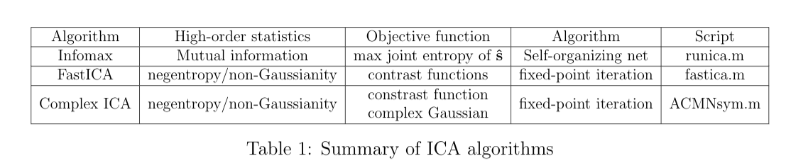

# The many algorithms of ICA
Contains scripts for both real-valued ICA and complex-valued ICA

### A brief summary of ICA algorithms

### ICA formulation and assumptions for algorithms

### Numerical test
* Test.m: test the performance of ACMNsym.m on synthetic datasets with circular or non-circular sources
